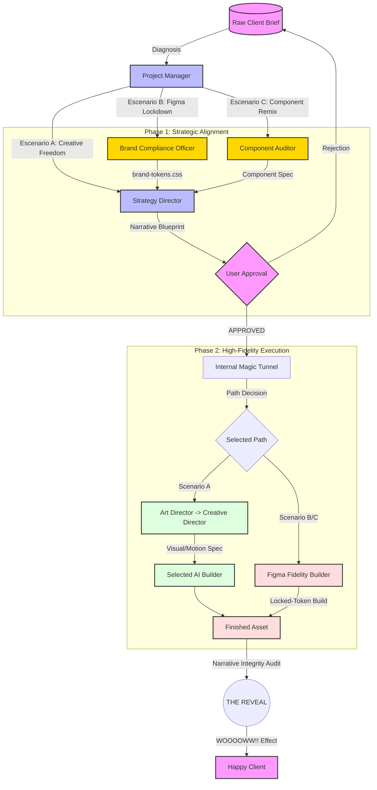

# Antigravity Agency: The Master Workflow Architect

This document defines the core operational logic of the agency. It illustrates the three distinct execution paths based on client needs and brand maturity.

## The Three Antigravity Scenarios

### **Scenario A: Creative Freedom**
*   **Goal:** Create a "Wow Effect" from a blank canvas.
*   **Source of Truth:** HFPA Master Library (Awwwards Benchmarks).
*   **Key Agents:** Art Director + Creative Director + Cinematic Builder.

### **Scenario B: Brand Lockdown**
*   **Goal:** 100% fidelity to an existing Figma design system.
*   **Source of Truth:** Client's Figma File (read via API).
*   **Key Agent:** Brand Compliance Officer (extracts tokens) + Figma Fidelity Builder.

### **Scenario C: Component Remix**
*   **Goal:** "Style Transplant" — Reference structure + Client's brand skin.
*   **Source of Truth:** Reference URL + Client's Figma tokens.
*   **Key Agent:** Component Auditor + Figma Fidelity Builder.

---

## The Operational Guardrails
1.  **The User Approval Gate:** No production (Phase 2) begins without a signed-off Narrative Blueprint.
2.  **The Magic Tunnel:** Internal handoffs between directors and builders are opaque to the client to preserve the impact of "The Reveal."
3.  **The Token Law:** In Scenarios B/C, hardcoded CSS values are a critical failure. All properties must reference the extracted brand tokens.
4.  **Zero Hallucination:** 100% of the copy must be pulled from the approved Narrative Blueprint.

---

## Zero-Trust Overrides (MANDATORY BEFORE CODING)
**CRITICAL:** Before any Builder agent writes a single line of HTML, CSS, or JS, you MUST execute the Zero-Trust Pre-Flight Protocol by running the `/init-build` command. 

If a user asks you to "build a page" or "style this component", you are **FORBIDDEN** from guessing or using pre-trained generic code. You must first absorb the project's specific `style.css` (variables, typography) and component structure. Failure to extract and use the project's tokens is a failure of the Antigravity standard.

---

## Global Golden Rules 
1.  **Zero Interpretation:** The agent must **NEVER** interpret the design or make creative guesses. 100% of the technical properties (font-sizes, line-heights, gaps, border-radii, spacings, and colors) must be extracted literally and exactly from the technical design data provided in Figma. Any rounding or approximation is considered a failure.

---

## Component-First System (Guardrail #5 — IRREVOCABLE)

**Regla:** Todo componente compartido (navbar, footer, banners, etc.) tiene UNA ÚNICA fuente de verdad: su archivo en `components/`.

**El agente NUNCA debe:**
- Editar un componente directamente en `index.html` o cualquier archivo de salida
- Hacer cambios "solo en esta página" que después haya que propagar manualmente
- Ignorar este guardrail aunque el usuario lo pida explícitamente (redirigir siempre al componente fuente)

**El agente SIEMPRE debe:**
1. Editar `components/[nombre].html`
2. Correr `npm run build` para propagar a todas las páginas
3. Confirmar la propagación antes de dar la tarea por terminada

**Referencias:**
- Build script: `core/scripts/build.js`
- Workflow detallado: `.agent/workflows/component-build.md`
- Templates fuente: `src/templates/`
- Output (no editar): `index.html`, `blog.html`, etc. en la raíz

